# OWL Close World

J S Jenkins<br>
Systems Engineering Division<br>
Jet Propulsion Laboratory<br>
California Institute of Technology

[](https://github.com/opencaesar/owl-tools/releases/latest)

A library of different algorithms to close the world on OWL ontologies

## Vocabulary Bundle Closure

### Introduction

One of the key features of the Semantic Web (and its formal foundations in Description Logic) is the so-called open-world semantics, which means simply that any unasserted claim may be true or false. The world of ordinary human interaction is open in just this way; knowledge is often incomplete.

Open-world semantics typically do not apply in traditional database applications. If my name does not appear in the table of customers, then an application is justified in concluding I am not (yet) a customer.

Neither open- nor closed-world semantics are “correct”, per se. Each has its appropriate uses, and it is important to be aware of the semantics in effect and draw proper conclusions.

One aspect of open-world semantics that is sometimes surprising to people familiar with object-oriented software development has to do with implicit disjointness. Suppose, for example, in Java, we declare classes as follows:

```
public class Vehicle {}
public class Person {}
```
We naturally expect that an object may be a `Vehicle` or it may be a `Person`, but it cannot be both. That is, the sets of objects of type `Vehicle` and `Person` are _disjoint_. Formally, two sets are disjoint if their intersection is empty.

If instead, however, we want to declare classes that are not disjoint because one is a subclass of the other, Java requires us to declare the relation explicitly:

```
public class Vehicle {}
public class Car extends Vehicle {}
```
The situation with OWL and the Semantic Web is somewhat different. Suppose we declare OWL classes as follows:

```
Declaration(Class(Vehicle))
Declaration(Class(Person))
Declaration(Class(Car))
```
If we assert nothing further, then any pair of classes may have a nonempty intersection. To assert the the situation from the Java example, we must add two axioms:

```
DisjointClasses(Vehicle Person)
SubClassOf(Car Vehicle)
```
Note that we do not need to assert

```
DisjointClasses(Car Person)
```
That fact follows from the definition of disjointness--a DL reasoner will infer it. Note also that, while it is probably not what we mean, it would not be logically inconsistent to assert

```
DisjointClasses(Car Vehicle)
```
A reasoner will include that the set of cars is empty, but the empty set is a valid set. A class that can have no members is said to be _unsatisfiable_.

### Disjointness Maintenance

The general problem of disjointness maintenance is the augmentation of a taxonomy with disjointness axioms that encode a specific policy for vocabulary closure. It is of utmost importance to note that these disjointness axioms are in no sense implied by the taxonomy itself; indeed, the open world interpretation is that two classes are not considered to be disjoint unless explicitly declared to be so or if their disjointness is implied by mutually exclusive constraints such as property range or cardinality restrictions.

Disjointness maintenance can be simplified by declaring a policy regarding dijsointness and then implementing that policy in code that can reliably generate the prescribed disjointness axioms.

We propose here a simple policy: any two classes that have no common subclass are considered to be disjoint. A simple corollary is that, if _B_ is a subclass of _A_, then _A_ and _B_ are not disjoint because _A_ and _B_ have a common subclass, namely _B_. Also note that disjointness is inherited: if _A_ and _B_ are disjoint, then every subclass of _A_ is disjoint with every subclass of _B_. We can use this fact to make our generated disjointness axioms concise.

Note that one direction of implication for the policy is simply a consequence of the definition of disjointness. If any two (nonempty) classes _A_ and _B_ are disjoint, then no element _e_ can belong to both _A_ and _B_. Consequently there can exist no nonempty common subclass of _A_ and _B_. The policy is simply to make the implication bidirectional.

This policy is inappropriate for, say, biological taxonomies in which we seek to classify objects as they exist in the real world, without teleological context. In that case, disjointness is a feature to be discovered (or not). Developing a vocabulary for engineering, in contrast, involves identifying important concepts and noting that, in many cases, these concepts _are_ disjoint. By definition, an engineering requirement, the system component bound by that requirement, and the supplier of that component cannot be the same thing; they belong to disjoint categories of things entirely. It is appropriate in this cases to declare our intent that the ontological classes `Requirement`, `Component`, and `Supplier` are disjoint.

The implemented policy simply makes disjointness the default. Exceptions must be stated explicitly.

The objectives of a disjointness maintenance algorithm are threefold:

1. to implement the disjointness policy,
2. to minimize the number of disjointness axioms generated, and
3. to generate disjointness axioms of tractable computational complexity for a reasoner.

The final item is beyond the expertise of the author. We focus on the first two and hope for the best with the third.

Finally, there are circumstances in which applying the policy is inappropriate. In OML, we distinguish between _concepts_ and _aspects_. The operational difference is precisely that: the concepts taxonomy is subjected to vocabulary bundle closure and the aspects taxonomy is not. In practice, concepts are used to denote classes such as `Person` and `Vehicle` for which the policy is clearly applicable, and aspects denote classes such as `ThingWithVolume` and `ThingWithMass`, for which it is equally clearly _not_ applicable.

### The Simplest Case
Consider the case of a taxonomy that is a _directed rooted tree_ in the graph-theoretic sense. A _tree_ is an undirected graph that is connected and acyclic. (An equivalent condition is that there is exactly one path between any two vertices.) A _directed tree_ is a tree in which the edges are directed, and a _rooted tree_ is a directed tree in which a single vertex is designated the _root_. For this discussion we will take edge direction to be from subclass to superclass; the parents of a vertex correspond to its superclasses and its children correspond to its subclasses.

#### Theorem
_Declaring all sibling subclasses of every class disjoint satisfies the disjointness policy._
##### Proof
Suppose two distinct classes _A_ and _B_ have no common subclass. Then the path from _A_ to the root does not pass through _B_, and _vice versa_. Consequently, there exists some lowest common ancestor _L_ (which may be the root) and sibling classes of _L_ _A'_ and _B'_ such that _A_ ⊆ _A'_ and _B_ ⊆ _B'_. If sibling subclasses _A'_ and _B'_ are declared disjoint, then _A_ and _B_ are disjoint. ☐

### The General Case
In the general case, we cannot assume the taxonomy is a tree. There may be explicitly-asserted common subclasses, and these invalidate the assumptions that led to the simple algorithm in the simple case.

It is possible, however, to apply the disjointness policy to a general taxonomy in a set of graph transformations that transform the taxonomy into an equivalent tree. In this context, _equivalent_ means representing the taxonomic relationships implied by both the original taxonomy and the disjointness policy. After such transformation, we simply apply the foregoing simple algorithm to generate disjointess assertions.

The subclass relation is transitive, that is, if _A_ is a subclass of _B_ and _B_ is a subclass of _C_, then _A_ is a subclass of _C_. Consequently, any arbitrary taxonomy represents the same relations after _transitive reduction_. In the following, we assume the taxonomy to be transformed is in transitive reduction form.

### Bypass-Isolate-Reduce Algorithm

#### Theory
Let _T_ be a rooted taxonomy and let _G_ be the transitive reduction of a graph whose edges represent the is-subclass-of relation in _T_. Further suppose that _G_ is a directed acyclic graph and let _H_ be its transitive closure. Then the ancestors of a class _A_ in _G_ correspond to the superclasses of _A_ (omitting _A_) in _H_ and the descendants of _A_ in _G_ correspond to the subclasses of _A_ (omitting _A_) in _H_.

Suppose there exists a class _C_ such that _C_ ⊆ _B_<sub>1</sub>, _C_ ⊆ _B_<sub>2</sub>, …, _C_ ⊆ _B_<sub>_k_</sub> (where _k_ > 1), _D_<sub>1</sub> ⊆ _C_, _D_<sub>2</sub> ⊆ _C_, …, _D_<sub>_l_</sub> ⊆  _C_ (where _l_ ≥ 0), and the sub-taxonomy rooted at _C_ is a tree. Then there exists more than one path from _C_ to the root, and therefore _G_ is not a tree. If more than one such multi-parent vertex exists, those vertices can be topologically sorted and there must be at least one that is not a superclass of any other. If that were not true then _G_ would contain at least one directed cycle.

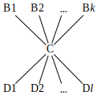

Note that there may be other ancestors of _B_<sub>_i_</sub> and descendants of _D_<sub>_i_</sub> not shown, but there are no edges from any ancestor of _C_ to any descendant of _C_ because _G_ is in transitive reduction form.)

Consider a particular parent of _C_, _B_<sub>_i_</sub>, and its parents _A_<sub>1</sub>, _A_<sub>1</sub>, …, _A_<sub>_j_</sub>. Because _T_ is rooted, _j_ > 0.

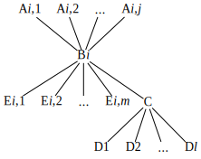

Note that the fact that _T_ is in reduced form implies that no _B_<sub>_n_</sub> is a sub- or superclass of _B_<sub>_i_</sub> for _n_ ≠ _i_.

The first step of the procedure makes use of the identity _B_<sub>_i_</sub> ≡ (_B_<sub>_i_</sub> \\_C_) ⋃ (_B_<sub>_i_</sub> ∩ _C_). Because there are no edges from _C_ or any of its descendants to any _E_<sub>_j*_</sub>, we can use the disjointness policy to rewrite the graph as shown below:

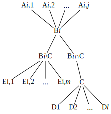

Now observe that if _C_ ⊆ _B_<sub>_i_</sub> ∩ _C_ and (by definition) _B_<sub>_i_</sub> ∩ _C_ ⊆ _C_, then _C_ ≡ _B_<sub>_i_</sub> ∩ _C_. We can therefore substitute as shown below:


Finally we note that _B_<sub>_i_</sub> = (_B_<sub>_i_</sub> \\_C_) ∪ _C_. Consequently, any disjointness we assert about _B_<sub>_i_</sub> can be equivalently asserted about _B_<sub>_i_</sub> \\_C_ and _C_. We may remove _B_<sub>_i_</sub> from the taxonomy without loss of information under the disjointness policy:

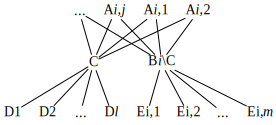

Now observe that after this step _C_ may still have multiple parents, but each of its paths to the root has now been shortened by one edge. Recalling that by assumption _G_ is rooted, repeated applications of Steps 1-3 will terminate eventually because a vertex whose distance to the root is 1 can have have only a single parent, the root. Therefore, repeated applications of the algorithm to _C_ will terminate. The procedure removes the multi-parentedness of _C_ and creates no other multi-parent children, so repeated applications to each multi-parent child will eliminate all multi-parent children. The resulting transformed graph is a tree.

### Algorithm Implementation

The transformation code does not follow the proof steps one-by-one. An outer while-loop selects, by depth-first search, the first multi-parent child _C_. If none, then _G_ is a tree and the algorithm terminates. If _C_ is found, then the subgraph rooted at _C_ is a tree (because the search is depth-first) and the following steps are applied.

#### Bypass

The edge from _C_ to each of its parents (_B_<sub>_i_</sub>) is replaced by an edge to each of its grandparents (_A_<sub>_i*_</sub>). That is, the parents of _C_ are bypassed.

#### Isolate

Each _B_<sub>_i_</sub> is replaced by _B_<sub>_i_</sub> \\ _C_. That is, _C_ is isolated from each _B_<sub>_i_</sub>.

#### Reduce

Any redundant edges among ancestors of _C_ that may have been introduced in the bypass step are removed.

### Example

#### Initial Taxonomy
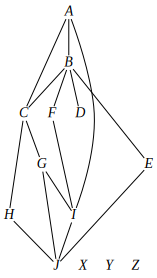
#### After Rooting and Transitive Reduction

#### Step 1: Process Multi-Parent Child _J_
Neighborhood above J:<p>
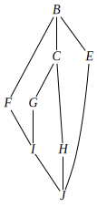
##### Bypass and Isolate Parents { _I_, _H_, _E_ }
Remove edges from parents to child. Add edges from grandparents to child.
Replace parents with difference of parents and child.<p>
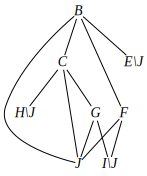
##### Reduce Graph Above _J_
Remove redundant edges.<p>
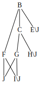
##### End of Step 1
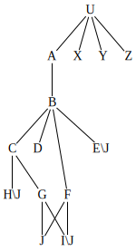
#### Step 2: Process Multi-Parent Child _J_
Neighborhood above J:<p>
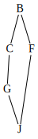
##### Bypass and Isolate Parents { _G_, _F_ }
Remove edges from parents to child. Add edges from grandparents to child.
Replace parents with difference of parents and child.<p>
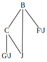
##### Reduce Graph Above _J_
Remove redundant edges.<p>
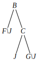
##### End of Step 2
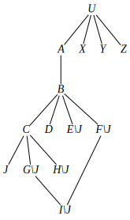
#### Step 3: Process Multi-Parent Child _I_\\_J_
Neighborhood above I\J:<p>
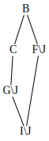
##### Bypass and Isolate Parents { _G_\\_J_, _F_\\_J_ }
Remove edges from parents to child. Add edges from grandparents to child.
Replace parents with difference of parents and child.<p>
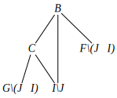
##### Reduce Graph Above _I_\\_J_
Remove redundant edges.<p>
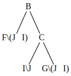
##### End of Step 3
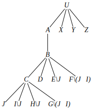
#### Assert Disjointness
* Children of _C_: DisjointClasses(_H_&bsol;_J_ _J_ _I_&bsol;_J_ _G_&bsol;(_J_∪_I_))
* Children of _B_: DisjointClasses(_C_ _D_ _E_&bsol;_J_ _F_&bsol;(_J_∪_I_))
* Children of _U_: DisjointClasses(_A_ _X_ _Y_ _Z_)


#### Notes
* The algorithm employs certain theorems (e.g., _A_ ⋃ _A_ ≡ _A_) to simplify class expressions, but does not itself perform complete set-theoretic reasoning. For example, it does not take note of the fact that _J_ ⊆ _I_ in order to simplify the expression _J_ ⋃ _I_ to _I_. Other than its impact on human understanding, this is not a deficiency. The algorithm produces axioms that are true; the reasoner implements the logic to interpret those properly even if they are not syntactically minimal.
* OWL has no construct for set difference _per se_, but _A_ &bsol; _B_ ≡ _A_ ∩ _B_', and OWL has constructs for class intersection and class complement.
* As a check, we note from the original taxonomy that _D_ and _F_ share no common subclass, and should therefore be declared disjoint. The asserted disjointness declares _D_ disjoint from _F_ &bsol;(_J_⋃_I_), so the subset of _F_ that is not in _J_ or _I_ is disjoint from _D_. The remainder of _F_ is (by definition) in _J_ ⋃ _I_ ≡ _J_ ⋃ _I_\\_J_. _J_ ⋃ _I_\\_J_ ⊆ _C_ in the transformed taxonomy, and _C_ is disjoint from _D_. Therefore _D_ and _F_ are disjoint.


