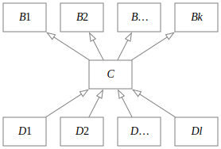
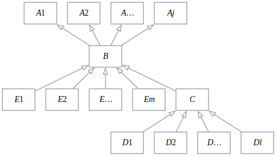
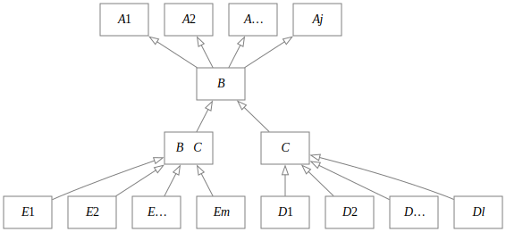
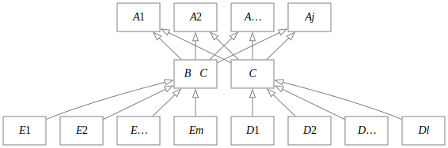
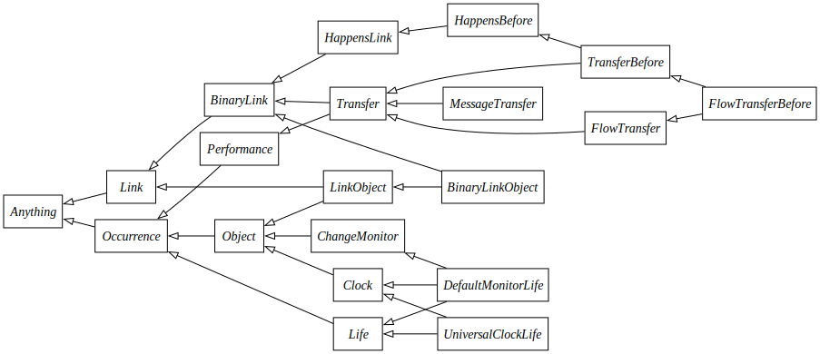
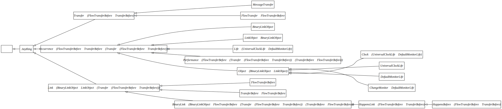

# OpenCAESAR Vocabulary Bundle Closure

_J S Jenkins<br>Systems Engineering Division<br>Jet Propulsion Laboratory<br>California Institute of Technology_<br>
2024-05-30

## Introduction

One of the key features of the Semantic Web (and its formal foundations in Description Logic) is the so-called open-world semantics, which means simply that any unasserted claim may be true or false. The world of ordinary human interaction is open in just this way; knowledge is often incomplete.

Open-world semantics typically do not apply in traditional database applications. If my name does not appear in the table of customers, then an application is justified in concluding I am not (yet) a customer.

Neither open- nor closed-world semantics are “correct”, per se. Each has its appropriate uses, and it is important to be aware of the semantics in effect and draw proper conclusions.

One aspect of open-world semantics that is sometimes surprising to people familiar with object-oriented software development has to do with implicit disjointness. Suppose, for example, in Java, we declare classes as follows:

```
public class Vehicle {}
public class Person {}
```
We naturally expect that an object may be a `Vehicle` or it may be a `Person`, but it cannot be both. That is, the sets of objects of type `Vehicle` and `Person` are _disjoint_. Formally, two sets are disjoint if their intersection is empty.

If instead, however, we want to declare classes that are not disjoint because one is a subclass of the other, Java requires us to declare the relation explicitly:

```
public class Vehicle {}
public class Car extends Vehicle {}
```
The situation with OWL and the Semantic Web is somewhat different. Suppose we declare OWL classes as follows:

```
Declaration(Class(Vehicle))
Declaration(Class(Person))
Declaration(Class(Car))
```
If we assert nothing further, then any pair of classes may have a nonempty intersection. To assert the the situation from the Java example, we must add two axioms:

```
DisjointClasses(Vehicle Person)
SubClassOf(Car Vehicle)
```
Note that we do not need to assert

```
DisjointClasses(Car Person)
```
That fact follows from the definition of disjointness--a DL reasoner will infer it. Note also that, while it is probably not what we mean, it would not be logically inconsistent to assert

```
DisjointClasses(Car Vehicle)
```
A reasoner will include that the set of cars is empty, but the empty set is a valid set. A class that can have no members is said to be _unsatisfiable_.

## Disjointness Maintenance

The general problem of disjointness maintenance is the augmentation of a taxonomy with disjointness axioms that encode a specific policy for vocabulary closure. It is of utmost importance to note that these disjointness axioms are in no sense implied by the taxonomy itself; indeed, the open world interpretation is that two classes are not considered to be disjoint unless explicitly declared to be so or if their disjointness is implied by mutually exclusive constraints such as property range or cardinality restrictions.

Disjointness maintenance can be simplified by declaring a policy regarding disjointness and then implementing that policy in code that can reliably generate the prescribed disjointness axioms.

We propose here a simple policy: any two classes that have no common named subclass are considered to be disjoint. A simple corollary is that, if _B_ is a subclass of _A_, then _A_ and _B_ are not disjoint because _A_ and _B_ have a common subclass, namely _B_. Also note that if _A_ and _B_ are disjoint, then every subclass of _A_ is disjoint with every subclass of _B_. We can use this fact to reduce the number of disjointness axioms.

Note that one direction of implication for the policy is simply a consequence of the definition of disjointness. If any two (nonempty) classes _A_ and _B_ are disjoint, then no element _e_ can belong to both _A_ and _B_. Consequently there can exist no nonempty common subclass of _A_ and _B_. The policy is simply to make the implication bidirectional.

This policy is inappropriate for, say, biological taxonomies in which we seek to classify objects as they exist in the real world, without teleological context. In that case, disjointness is a feature to be discovered (or not). Developing a vocabulary for engineering, in contrast, involves identifying important concepts and noting that, in many cases, these concepts _are_ disjoint. By definition, an engineering requirement, the system component bound by that requirement, and the supplier of that component cannot be the same thing; they belong to disjoint categories of things entirely. It is appropriate in this cases to declare our intent that the ontological classes `Requirement`, `Component`, and `Supplier` are disjoint.

The implemented policy simply makes disjointness the default. Exceptions must be stated explicitly.

The objectives of a disjointness maintenance algorithm are threefold:

1. to implement the disjointness policy,
2. to minimize the number of disjointness axioms generated, and
3. to generate disjointness axioms of tractable computational complexity for a reasoner.

The final item is beyond the expertise of the author. We focus on the first two and hope for the best with the third.

Finally, there are circumstances in which applying the policy is inappropriate. In OML, we distinguish between _concepts_ and _aspects_. The operational difference is precisely that: the concepts taxonomy is subjected to vocabulary bundle closure and the aspects taxonomy is not. In practice, concepts are used to denote classes such as `Person` and `Vehicle` in which the policy is clearly applicable, and aspects denote classes such as `ThingWithVolume` and `ThingWithMass`, in which it is equally clearly not applicable.

A terminological note: when we speak of two classes having a common subclass, we mean an explicitly-named subclass in the taxonomy; that is, defined and related to its superclasses by axioms.

## The Simplest Case
Consider the case of a taxonomy that is a _directed rooted tree_ in the graph-theoretic sense. A _tree_ is an undirected graph that is connected and acyclic. (An equivalent condition is that there is exactly one path between any two vertices.) A _directed tree_ is a tree in which the edges are directed, and a _rooted tree_ is a directed tree in which a single vertex is designated the _root_. For this discussion we will take edge direction to be from subclass to superclass; the parents of a vertex correspond to its superclasses and its children correspond to its subclasses.

### Theorem
_If the taxonomy is a rooted tree, declaring all sibling subclasses of every class disjoint satisfies the disjointness policy._
##### Proof
Suppose two distinct classes _A_ and _B_ have no common subclass. Then the path from _A_ to the root does not pass through _B_, and _vice versa_. Consequently, there exists some lowest common ancestor _L_ (which may be the root) and sibling classes of _L_ _A'_ and _B'_ such that _A_ ⊆ _A'_ and _B_ ⊆ _B'_. If sibling subclasses _A'_ and _B'_ are declared disjoint, then _A_ and _B_ are disjoint. ☐

### Illustration

## The General Case
In the general case, we cannot assume the taxonomy is a tree. There may be explicitly-asserted common subclasses, and these invalidate the assumptions that led to the simple algorithm in the simple case.

It is possible, however, to apply the disjointness policy to a general taxonomy in a sequence of graph transformations that transform the taxonomy into an tree representing a subset of the taxonomic relationships implied by the original taxonomy and the consequences of the policy. After such transformation, we simply apply the foregoing simple algorithm to generate disjointness axioms.

The complete taxonomic semantics of the original taxonomy plus the disjointness policy are conveyed in the original taxonomy, the transformed tree, and the generated disjointness axioms. All must be supplied to the reasoner to infer discover all entailed disjointness.

The subclass relation is transitive, that is, if _A_ ⊆ _B_ and _B_ ⊆ _C_, then _A_ ⊆ _C_. Consequently, any arbitrary taxonomy represents the same relations after _transitive reduction_.

## Bypass-Reduce-Isolate Algorithm

### Theory
Let _T_ be a taxonomy and let _G_ be a graph whose edges represent the is-subclass-of relation in _T_. If _G_ is not single-rooted, we can without penalty insert a unique root so that it is single-rooted. If _G_ contains any directed cycles (or more precisely, any strongly connected components), we can replace _G_ by its [condensation](https://en.wikipedia.org/wiki/Strongly_connected_component#Definitions). The reasoner will find all classes in a strongly connected component to be equivalent. Consequently, we can substitute any class from the component for the component in the condensation. Finally, we can perform transitive reduction on _G_. Therefore we assume in the following that _G_ is a directed acyclic rooted graph in transitive reduction form.

Suppose there exists a class _C_ such that _C_ ⊆ _B_<sub>1</sub>, _C_ ⊆ _B_<sub>2</sub>, …, _C_ ⊆ _B_<sub>_k_</sub> (where _k_ > 1), _D_<sub>1</sub> ⊆ _C_, _D_<sub>2</sub> ⊆ _C_, …, _D_<sub>_l_</sub> ⊆  _C_ (where _l_ ≥ 0). Then there exists more than one path from _C_ to the root, and therefore _G_ is not a tree. If more than one such multi-parent vertex exists, those vertices can be topologically sorted and there must be at least one that is not a superclass of any other. (If that were not true then _G_ would contain at least one directed cycle.) Let _C_ be that vertex. Then the graph rooted at _C_ is a tree.



The fact that _G_ is in reduced form implies that no _B_<sub>_n_</sub> is a sub- or superclass of _B_<sub>_i_</sub> for _n_ ≠ _i_.

Consider a particular parent of _C_ (call it _B_). _B_ cannot be the root, otherwise _G_ would not be in transitive reduction form. _B_ must therefore have at least one parent vertex (call them _A_<sub>1</sub>, _A_<sub>1</sub>, …, _A_<sub>_j_</sub>).



The first step of the procedure makes use of the identity _B_ ≡ (_B_ \\_C_) ⋃ (_B_ ∩ _C_). Because the graph rooted at _C_ is a tree, there can be no edges from _C_ or any of its descendants to any _E_<sub>_n_</sub>. The disjointness policy therefore implies that _E_<sub>_n_</sub> is disjoint from _C_, and therefore _E_<sub>_n_</sub> ⊆ _B_ \\_C_ for every _E_<sub>_n_</sub>. Moreover, _C_ ⊆ _B_ implies that _B_ ∩ _C_ ≡ _C_. We can therefore substitute as shown below:



Now note that the subclass relations between _B_ and its parents and that between _B_ and _C_ are asserted in the original taxonomy (which will be provided to the reasoner) and need not be repeated in the transformed taxonomy. Finally note that _B_ \\_C_ ⊆ _B_ by definition. That relation may also be omitted from the transformed taxonomy.



Now observe that after this step is applied to each parent _B_<sub>_i_</sub> of _C_, _C_ may still have multiple parents, but the length of its longest path to the root has now been reduced by one. Recalling that by assumption _G_ is rooted, repeated applications of Steps 1-3 will terminate eventually because a vertex with unit distance to the root has only a single parent, the root. Therefore, repeated applications of the algorithm to _C_ will converge. The procedure eliminates the multi-parentedness of _C_ and creates no other multi-parent children, so repeated applications to each multi-parent child will eliminate all multi-parent children. The resulting transformed graph is a tree.

### Relation to Partition Refinement

This algorithm bears some similarity to the algorithm for *relational coarsest partition* described in R. Paige and R. E. Tarjan, Three Partition Refinement Algorithms, *SIAM Journal on Computing*, Society for Industrial and Applied Mathematics (SIAM), Jan 1987. The definitive version is available at https://doi.org/10.1137/0216062.

## Algorithm Implementation

The transformation code does not follow the proof steps one-by-one. An outer while-loop selects, by depth-first search, the first multi-parent child _C_. If none, then _G_ is a tree and the algorithm terminates. If _C_ is found, then the subgraph rooted at _C_ is a tree (because the search is depth-first) and the following steps are applied. 

### Bypass

The edge from _C_ to each of its parents (_B_<sub>_i_</sub>) is replaced by an edge to each of its grandparents (_A_<sub>_i,n_</sub>). That is, the parents of _C_ are bypassed.

### Reduce

The _bypass_ step may leave _G_ no longer in transitive reduction form. The _reduce_ step removes any redundant edges among ancestors of _C_.

### Isolate

The _isolate_ step replaces each _B_<sub>_i_</sub> with _B_<sub>_i_</sub> \\ _C_.

### Class Expression Library

The fundamental data structure underlying the algorithm is a graph of class expressions involving complement, difference, intersection, and union of named (unitary) classes. The library that implements these expressions employs a handful of theorems to simplify certain cases. For example:
* _A_ ⋃ (_B_ ⋃ _C_) ≡ (_A_ ⋃ _B_ ⋃ _C_)
* (_A_ \\ _B_) \\ _C_ ≡ _A_ \\ (_B_ ⋃ _C_)
* _A_ \\ _A_ ≡ ∅

These simplifications are syntactic only; the algorithm does not perform full set-theoretic reasoning, which is after all the job of the reasoner for which the bundle closure algorithm produces input. Non-minimality of expressions has so far presented no difficulties in practice.

## Simple Example

## Non-Trivial Example
This example is drawn from an experiment to encode the taxonomy of the KerML Libraries. It is an extract of that larger problem that is complex enough to have a non-obvious solution but small enough that the solution can be calculated directly for comparison.

### Original Taxonomy



### Exhaustive Disjointness Enumeration

It is a straightforward calculation to find all descendant subclasses of each of the 20 classes in this taxonomy, and to compute the intersection of the sets of descendants of all 190 pairs of distinct classes. If that intersection is empty, the classes are deemed disjoint by policy. We expect our bundle closure algorithm to conclude that those pairs, and only those pairs, are disjoint.

The result of that computation follows.

#### Disjoint Class Pairs

| class 1 | class 2 |
|---------|---------|
| BinaryLink | ChangeMonitor |
| BinaryLink | Clock |
| BinaryLink | DefaultMonitorLife |
| BinaryLink | Life |
| BinaryLink | UniversalClockLife |
| BinaryLinkObject | ChangeMonitor |
| BinaryLinkObject | Clock |
| BinaryLinkObject | DefaultMonitorLife |
| BinaryLinkObject | FlowTransfer |
| BinaryLinkObject | FlowTransferBefore |
| BinaryLinkObject | HappensBefore |
| BinaryLinkObject | HappensLink |
| BinaryLinkObject | Life |
| BinaryLinkObject | MessageTransfer |
| BinaryLinkObject | Performance |
| BinaryLinkObject | Transfer |
| BinaryLinkObject | TransferBefore |
| BinaryLinkObject | UniversalClockLife |
| ChangeMonitor | Performance |
| Clock | Performance |
| DefaultMonitorLife | Performance |
| FlowTransfer | ChangeMonitor |
| FlowTransfer | Clock |
| FlowTransfer | DefaultMonitorLife |
| FlowTransfer | Life |
| FlowTransfer | MessageTransfer |
| FlowTransfer | Object |
| FlowTransfer | UniversalClockLife |
| FlowTransferBefore | ChangeMonitor |
| FlowTransferBefore | Clock |
| FlowTransferBefore | DefaultMonitorLife |
| FlowTransferBefore | Life |
| FlowTransferBefore | MessageTransfer |
| FlowTransferBefore | Object |
| FlowTransferBefore | UniversalClockLife |
| HappensBefore | ChangeMonitor |
| HappensBefore | Clock |
| HappensBefore | DefaultMonitorLife |
| HappensBefore | Life |
| HappensBefore | MessageTransfer |
| HappensBefore | Object |
| HappensBefore | UniversalClockLife |
| HappensLink | ChangeMonitor |
| HappensLink | Clock |
| HappensLink | DefaultMonitorLife |
| HappensLink | Life |
| HappensLink | MessageTransfer |
| HappensLink | Object |
| HappensLink | UniversalClockLife |
| Link | ChangeMonitor |
| Link | Clock |
| Link | DefaultMonitorLife |
| Link | Life |
| Link | UniversalClockLife |
| LinkObject | ChangeMonitor |
| LinkObject | Clock |
| LinkObject | DefaultMonitorLife |
| LinkObject | FlowTransfer |
| LinkObject | FlowTransferBefore |
| LinkObject | HappensBefore |
| LinkObject | HappensLink |
| LinkObject | Life |
| LinkObject | MessageTransfer |
| LinkObject | Performance |
| LinkObject | TransferBefore |
| LinkObject | UniversalClockLife |
| MessageTransfer | ChangeMonitor |
| MessageTransfer | Clock |
| MessageTransfer | DefaultMonitorLife |
| MessageTransfer | Life |
| MessageTransfer | Object |
| MessageTransfer | UniversalClockLife |
| Object | Performance |
| Performance | Life |
| Transfer | ChangeMonitor |
| Transfer | Clock |
| Transfer | DefaultMonitorLife |
| Transfer | Life |
| Transfer | LinkObject |
| Transfer | Object |
| Transfer | UniversalClockLife |
| TransferBefore | ChangeMonitor |
| TransferBefore | Clock |
| TransferBefore | DefaultMonitorLife |
| TransferBefore | Life |
| TransferBefore | MessageTransfer |
| TransferBefore | Object |
| TransferBefore | UniversalClockLife |
| UniversalClockLife | ChangeMonitor |
| UniversalClockLife | DefaultMonitorLife |
| UniversalClockLife | Performance |

#### Non-Disjoint Class Pairs

| class 1 | class 2 |
|---------|---------|
| Anything | BinaryLink |
| Anything | BinaryLinkObject |
| Anything | ChangeMonitor |
| Anything | Clock |
| Anything | DefaultMonitorLife |
| Anything | FlowTransfer |
| Anything | FlowTransferBefore |
| Anything | HappensBefore |
| Anything | HappensLink |
| Anything | Life |
| Anything | Link |
| Anything | LinkObject |
| Anything | MessageTransfer |
| Anything | Object |
| Anything | Occurrence |
| Anything | Performance |
| Anything | Transfer |
| Anything | TransferBefore |
| Anything | UniversalClockLife |
| BinaryLink | BinaryLinkObject |
| BinaryLink | FlowTransfer |
| BinaryLink | FlowTransferBefore |
| BinaryLink | HappensBefore |
| BinaryLink | HappensLink |
| BinaryLink | LinkObject |
| BinaryLink | MessageTransfer |
| BinaryLink | Object |
| BinaryLink | Occurrence |
| BinaryLink | Performance |
| BinaryLink | Transfer |
| BinaryLink | TransferBefore |
| BinaryLinkObject | LinkObject |
| BinaryLinkObject | Object |
| BinaryLinkObject | Occurrence |
| ChangeMonitor | Life |
| ChangeMonitor | Occurrence |
| Clock | ChangeMonitor |
| Clock | DefaultMonitorLife |
| Clock | Life |
| Clock | Occurrence |
| Clock | UniversalClockLife |
| DefaultMonitorLife | ChangeMonitor |
| DefaultMonitorLife | Life |
| DefaultMonitorLife | Occurrence |
| FlowTransfer | Occurrence |
| FlowTransfer | Performance |
| FlowTransferBefore | FlowTransfer |
| FlowTransferBefore | Occurrence |
| FlowTransferBefore | Performance |
| HappensBefore | FlowTransfer |
| HappensBefore | FlowTransferBefore |
| HappensBefore | Occurrence |
| HappensBefore | Performance |
| HappensBefore | TransferBefore |
| HappensLink | FlowTransfer |
| HappensLink | FlowTransferBefore |
| HappensLink | HappensBefore |
| HappensLink | Occurrence |
| HappensLink | Performance |
| HappensLink | TransferBefore |
| Link | BinaryLink |
| Link | BinaryLinkObject |
| Link | FlowTransfer |
| Link | FlowTransferBefore |
| Link | HappensBefore |
| Link | HappensLink |
| Link | LinkObject |
| Link | MessageTransfer |
| Link | Object |
| Link | Occurrence |
| Link | Performance |
| Link | Transfer |
| Link | TransferBefore |
| LinkObject | Object |
| LinkObject | Occurrence |
| MessageTransfer | Occurrence |
| MessageTransfer | Performance |
| Object | ChangeMonitor |
| Object | Clock |
| Object | DefaultMonitorLife |
| Object | Life |
| Object | Occurrence |
| Object | UniversalClockLife |
| Occurrence | Life |
| Occurrence | Performance |
| Transfer | FlowTransfer |
| Transfer | FlowTransferBefore |
| Transfer | HappensBefore |
| Transfer | HappensLink |
| Transfer | MessageTransfer |
| Transfer | Occurrence |
| Transfer | Performance |
| Transfer | TransferBefore |
| TransferBefore | FlowTransfer |
| TransferBefore | FlowTransferBefore |
| TransferBefore | Occurrence |
| TransferBefore | Performance |
| UniversalClockLife | Life |
| UniversalClockLife | Occurrence |

Exhaustive enumeration is impractical for anything other than relatively small problems because the number of class pairs grows quadratically in the number of classes. The full KerML libraries taxonomy from which this example is drawn, for example, contains 498 classes, which implies 123,753 class pairs.

Moreover, the straightforward enumeration approach produces disjointness axioms for pairs of classes, which is not concise and likely redundant. Reducing these axioms to a smaller number of mutual disjointness axioms is equivalent to finding all [cliques](https://en.wikipedia.org/wiki/Clique_problem), a well-known problem in computer science with worse-than-polynomial complexity.

### Bundle Closure Results

The OpenCAESAR Java bundle closure application completes in 14 iterations of the outer loop and produces two results:

#### Transformed Taxonomy



#### Disjointness axioms

* Disjoint Children of _Anything_:
    * _Link_ ∖ (_BinaryLinkObject_ ∪ _LinkObject_ ∪ (_Transfer_ ∖ (_FlowTransferBefore_ ∪ _TransferBefore_)))
    * _Occurrence_ ∖ (_FlowTransferBefore_ ∪ _TransferBefore_ ∪ (_Transfer_ ∖ (_FlowTransferBefore_ ∪ _TransferBefore_)))
    * _Transfer_ ∖ (_FlowTransferBefore_ ∪ _TransferBefore_)
* Disjoint Children of _Link_ ∖ (_BinaryLinkObject_ ∪ _LinkObject_ ∪ (_Transfer_ ∖ (_FlowTransferBefore_ ∪ _TransferBefore_))):
    * _BinaryLink_ ∖ (_BinaryLinkObject_ ∪ _FlowTransferBefore_ ∪ (_Transfer_ ∖ (_FlowTransferBefore_ ∪ _TransferBefore_)) ∪ (_TransferBefore_ ∖ _FlowTransferBefore_))
    * _FlowTransferBefore_
    * _TransferBefore_ ∖ _FlowTransferBefore_
* Disjoint Children of _Object_ ∖ (_BinaryLinkObject_ ∪ _LinkObject_):
    * _ChangeMonitor_ ∖ _DefaultMonitorLife_
    * _Clock_ ∖ (_UniversalClockLife_ ∪ _DefaultMonitorLife_)
    * _DefaultMonitorLife_
    * _UniversalClockLife_
* Disjoint Children of _Occurrence_ ∖ (_FlowTransferBefore_ ∪ _TransferBefore_ ∪ (_Transfer_ ∖ (_FlowTransferBefore_ ∪ _TransferBefore_))):
    * _BinaryLinkObject_
    * _Life_ ∖ (_UniversalClockLife_ ∪ _DefaultMonitorLife_)
    * _LinkObject_ ∖ _BinaryLinkObject_
    * _Object_ ∖ (_BinaryLinkObject_ ∪ _LinkObject_)
    * _Performance_ ∖ (_FlowTransferBefore_ ∪ (_Transfer_ ∖ (_FlowTransferBefore_ ∪ _TransferBefore_)) ∪ (_TransferBefore_ ∖ _FlowTransferBefore_))
* Disjoint Children of _Transfer_ ∖ (_FlowTransferBefore_ ∪ _TransferBefore_):
    * _FlowTransfer_ ∖ _FlowTransferBefore_
    * _MessageTransfer_

### Results Verification

It is not immediately apparent that the subclass relations in the transformed taxonomy and the disjointness axioms suffice to conclude disjointness of class pairs as enumerated above. Drawing inferences that follow logically from axioms, especially when those inferences are not obvious, however, is a primary use case for a reasoner. We can employ the reasoner to check the results by creating a subclass of both classes of each pair. The reasoner should find each subclass unsatisfiable if and only if the corresponding pair of classes are disjoint.

OML provides a convenient syntax for the test model. OML concepts correspond to OWL classes that are subject to vocabulary bundle closure. We create a vocabulary expressing the original taxonomy and include it in a bundle. We then extend that vocabulary with 190 test concepts using this pattern:

`	concept BinaryLinkObject_FlowTransfer < example-vocabulary:BinaryLinkObject, example-vocabulary:FlowTransfer`

Running the standard OpenCAESAR workflow produces a reasoning report with the expected result. These (and only these) 91 classes are unsatisfiable:

| class |
|-------|
|BinaryLinkObject_ChangeMonitor|
|BinaryLinkObject_Clock|
|BinaryLinkObject_DefaultMonitorLife|
|BinaryLinkObject_FlowTransferBefore|
|BinaryLinkObject_FlowTransfer|
|BinaryLinkObject_HappensBefore|
|BinaryLinkObject_HappensLink|
|BinaryLinkObject_Life|
|BinaryLinkObject_MessageTransfer|
|BinaryLinkObject_Performance|
|BinaryLinkObject_TransferBefore|
|BinaryLinkObject_Transfer|
|BinaryLinkObject_UniversalClockLife|
|BinaryLink_ChangeMonitor|
|BinaryLink_Clock|
|BinaryLink_DefaultMonitorLife|
|BinaryLink_Life|
|BinaryLink_UniversalClockLife|
|ChangeMonitor_Performance|
|Clock_Performance|
|DefaultMonitorLife_Performance|
|FlowTransferBefore_ChangeMonitor|
|FlowTransferBefore_Clock|
|FlowTransferBefore_DefaultMonitorLife|
|FlowTransferBefore_Life|
|FlowTransferBefore_MessageTransfer|
|FlowTransferBefore_Object|
|FlowTransferBefore_UniversalClockLife|
|FlowTransfer_ChangeMonitor|
|FlowTransfer_Clock|
|FlowTransfer_DefaultMonitorLife|
|FlowTransfer_Life|
|FlowTransfer_MessageTransfer|
|FlowTransfer_Object|
|FlowTransfer_UniversalClockLife|
|HappensBefore_ChangeMonitor|
|HappensBefore_Clock|
|HappensBefore_DefaultMonitorLife|
|HappensBefore_Life|
|HappensBefore_MessageTransfer|
|HappensBefore_Object|
|HappensBefore_UniversalClockLife|
|HappensLink_ChangeMonitor|
|HappensLink_Clock|
|HappensLink_DefaultMonitorLife|
|HappensLink_Life|
|HappensLink_MessageTransfer|
|HappensLink_Object|
|HappensLink_UniversalClockLife|
|LinkObject_ChangeMonitor|
|LinkObject_Clock|
|LinkObject_DefaultMonitorLife|
|LinkObject_FlowTransferBefore|
|LinkObject_FlowTransfer|
|LinkObject_HappensBefore|
|LinkObject_HappensLink|
|LinkObject_Life|
|LinkObject_MessageTransfer|
|LinkObject_Performance|
|LinkObject_TransferBefore|
|LinkObject_UniversalClockLife|
|Link_ChangeMonitor|
|Link_Clock|
|Link_DefaultMonitorLife|
|Link_Life|
|Link_UniversalClockLife|
|MessageTransfer_ChangeMonitor|
|MessageTransfer_Clock|
|MessageTransfer_DefaultMonitorLife|
|MessageTransfer_Life|
|MessageTransfer_Object|
|MessageTransfer_UniversalClockLife|
|Object_Performance|
|Performance_Life|
|TransferBefore_ChangeMonitor|
|TransferBefore_Clock|
|TransferBefore_DefaultMonitorLife|
|TransferBefore_Life|
|TransferBefore_MessageTransfer|
|TransferBefore_Object|
|TransferBefore_UniversalClockLife|
|Transfer_ChangeMonitor|
|Transfer_Clock|
|Transfer_DefaultMonitorLife|
|Transfer_Life|
|Transfer_LinkObject|
|Transfer_Object|
|Transfer_UniversalClockLife|
|UniversalClockLife_ChangeMonitor|
|UniversalClockLife_DefaultMonitorLife|
|UniversalClockLife_Performance|